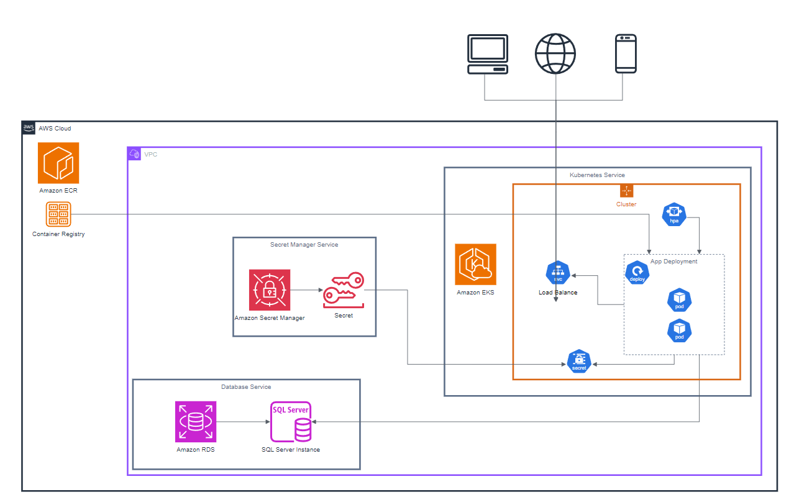

# Arquitetura De Infraestrutura

Para seguir o projeto, vamos utilizar a infraestrutura da AWS e seus serviços para construir a solução necessária.

##  ECR

Para armazenar as imagens e versões da aplicação, vamos usar o ECR da Amazon, com isso nossas imagens ficarão alocadas no Container Registry e serem usadas nas publicações que forem realizadas.

##  EKS

Como nossa arquitetura se baseia em ter a aplicação containerizada, utilizaremos o EKS como solução de Kubernetes, onde aplicaremos os arquivos de publicação e com isso a aplicação estará disponível para acesso, com todas as configurações de auto-scaling e acesso necessários.

##  RDS

Como serviço de persistência de dados vamos usar o RDS, fornecendo uma instância de base de dados de SQL Server, aproveitando a sinergia que possui junto ao .NET Framework e ao Entity Framework, usado pela aplicação para executar as operações de banco de dados.

##  Secret Manager

A aplicação precisará fazer acesso a dados e as outros serviços para fazer suas operações. As informações de conexão a esses serviços como login e password, secrets e ids ficarão armazenados no Amazon Secret Manager, que terá um vínculo ao EKS para que esses secrets sejam acessados pela aplicação via o próprio secret do Kubernetes.

## Versão Atual

Abaixo uma imagem representando última versão da solução de infraestrutura

